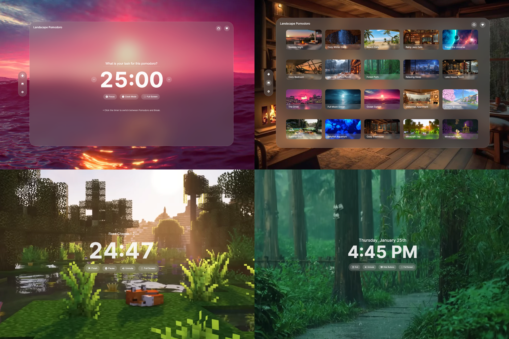

<a name="readme-top"></a>

<br />
<div align="center">
  <a href="https://github.com/kelvinqiu802/landscape">
    
  </a>

<h3 align="center">Landscape Pomodoro</h3>

  <p align="center">
	Pomodoro Timer with Dynamic Video Background
    <br />
    <a href="https://landscape-pomodoro.vercel.app">View Demo</a>
    ·
    <a href="https://github.com/kelvinqiu802/landscape/issues">Report Bug</a>
    ·
    <a href="https://github.com/kelvinqiu802/landscape/issues">Request Feature</a>
  </p>
</div>

<p align="center">
  <a href="https://github.com/kelvinqiu802/landscape/network/members">
    
  </a>
  <a href="https://github.com/kelvinqiu802/landscape/issues">
    
  </a>
  <a href="https://github.com/kelvinqiu802/landscape/stargazers">
    
  </a>
  <a href="https://github.com/kelvinqiu802/landscape/blob/main/LICENSE">
    
  </a>
</p>

## About The Project



Landscape Pomodoro is like having your own Pomodoro Timer, complete with beautiful background videos and calming sounds. Use it as your second screen to enhance your work efficiency in a relaxed and enjoyable manner.

## Getting Started

This is an example of how you may give instructions on setting up your project locally.
To get a local copy up and running follow these simple example steps.

### Installation

1. Clone the repo
   ```sh
   git clone https://github.com/kelvinqiu802/landscape.git
   cd landscape
   ```
2. Install NPM packages
   ```sh
   npm install
   ```
3. Build the project
   ```sh
   npm run build
   ```
4. Start the project
   ```sh
   npm run start
   ```

## Knowing Issues

- The **video quality** will enhance in a few seconds.
  - YouTube will automatically adjust the video quality based on your internet connection speed.

## Contributing

1. Expand the library of background videos in [youtube.json](./src/data/youtube.json).
2. Provide translations in various languages.
3. Address and resolve any identified bugs.
4. Introduce new features to enhance the overall functionality.

## License

Distributed under the `MIT` License. See `LICENSE` for more information.

## Contact

KelvinQiu - kelvinqiu802@outlook.com
